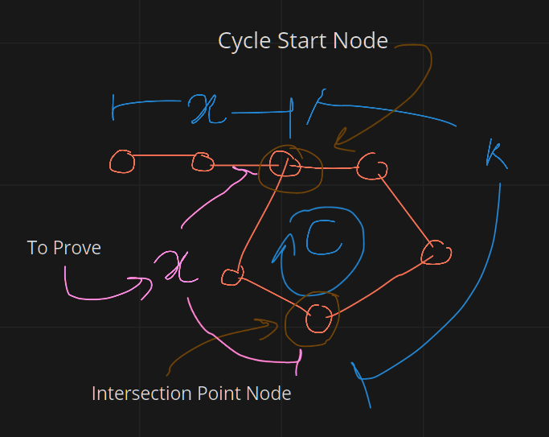

### Link List Floyd Cycle Detection

To Prove: "C - k = x"

->      fast = 2 * slow
->      x + n * C + k = 2 * (x + k)
->      n * C = x + k
->      C = x + k
->      C - k = x

Hence,Proved that:
The distance from intersection point to cyle starting point is equal to dist from link-list head to cycle starting point.